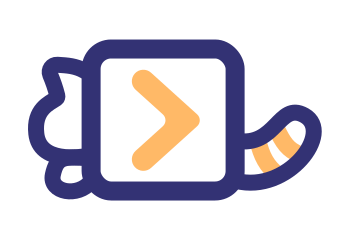

# dax

[](https://jsr.io/@david/dax)
[](http://www.npmjs.com/package/dax)



Cross-platform shell tools for Deno and Node.js inspired by [zx](https://github.com/google/zx).

[Docs](https://dax.land)

```ts
import $ from "dax";

// run a command
await $`echo 5`; // outputs: 5

// capture output
const branch = await $`git rev-parse --abbrev-ref HEAD`.text();

// make a request
const data = await $.request("https://plugins.dprint.dev/info.json").json();

// prompt for input
const name = await $.prompt("What's your name?");
```

## Differences with zx

1. Cross-platform shell.
   - Makes more code work on Windows.
   - Allows exporting the shell's environment to the current process.
   - Uses [deno_task_shell](https://github.com/denoland/deno_task_shell)'s parser.
   - Has common commands built-in for better Windows support.
1. Minimal globals or global configuration.
   - Only a default instance of `$`, but it's not mandatory to use this.
1. No custom CLI.
1. Good for application code in addition to use as a shell script replacement.
1. Named after my cat.
